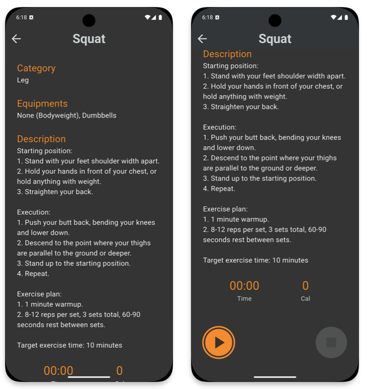

# FitStart

A mobile fitness application developed in flutter.

## Description

FitStart helps users build a consistent workout habit by offering motivation, step-by-step guidance, and progress tracking. It familiarizes users with workout facilities and equipment by showing them the (pictures) text guidance, creates personalized workout plans based on their goals, and provides an easy way to track progress and improvements. The app also offers a variety of exercises that do not require equipment, so users without access to gym facilities will receive the same benefits.

FitStart is designed for beginners who want to start their fitness journey and for people who value their well-being and want to stay on top of their exercise routines.

## App flow

### Sign in / Register

### Welcome Page
- This page is only for first time users, which allows them to provide their information, purposes, and available equipments.

### Home Page
- The home page of the app, which contains the following:
    1. Tracking the total calories burned and minutes of workout each day.
    2. Assigned workouts based on user's preferences and available equipments.
    3. Bottom navigation bar to different pages.

### Workout page
- Starting point of each individual workout, which has information about category, equipments that users can use for this workout, and description on how to setup and execute this exercies. 

- Clicking the start button to start the workout. Once finishing the workout, pause and end it, which will go to the end screen with recaps of this exercise.

### Updated Home Page
- Back to home page, the workout card will have a check mark indicates the workout is completed.

### Log Page
- A log page allows users to keep track of their workout progress.

### Personal Information Page
- Personal information page allows users to update their information, as well as preferences and available equipments. A logout button is provided for users to logout.

